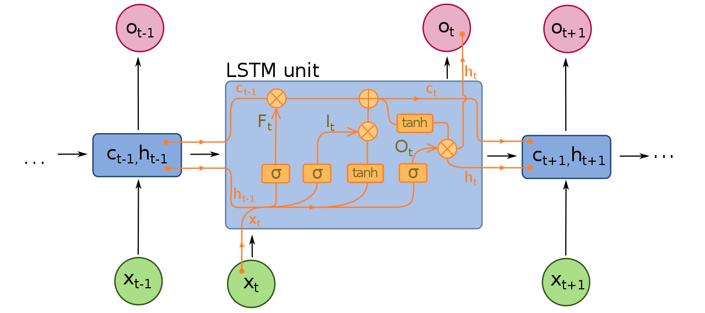
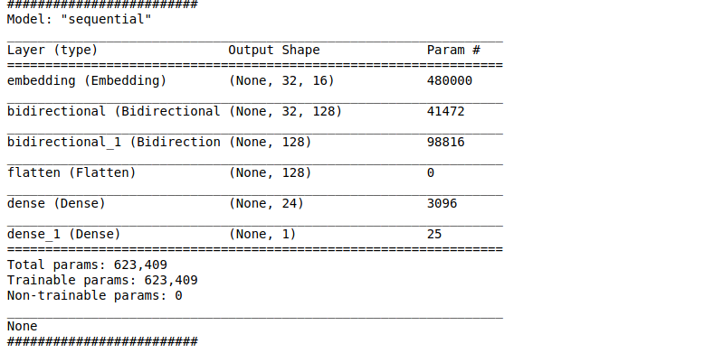
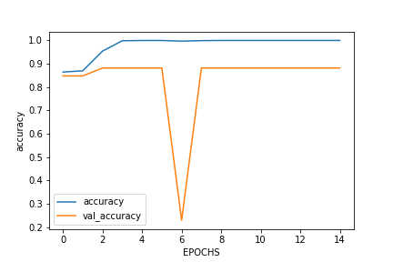
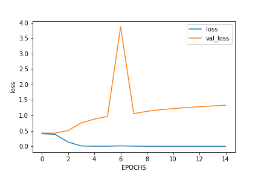

# Dataset 
Collected from Kaggle - (https://www.kaggle.com/team-ai/spam-text-message-classification).

The dataset is nothing but a '.csv' file with all the mails of two categories, these are spam and not spam(ham or normal)).
I considered that spam = 1 and not spam/ham = 0.
In the dataset there are approximately 5600 samples of dataset.
I trained the model on almost 4600 examples and validated it over the remaining 1000 samples.

# Model
This is an NLP.
The model that I have made is a sequence model with LSTM cells:

I have used two layers of Bidirectional LSTM's.
The parameters learned are Flattened using the Flatten layer from keras API and is given as an input to a fully connected neural network:

Model Architecture:

# Training and Testing 
The model was build using the Tensorflow framework. 
I trained the model for 15 EPOCHS. 
And each epoch took around 4 seconds to complete.
I trained the model many times until I got the best model.
The Spam Model directory contains of the saved model.
Refer to tensorflow docs to see how to save and load a pretrained model (https://www.tensorflow.org/guide/keras/save_and_serialize). For this saved model i got a Training accuray of 1.000(100%) and Validation accuray of 0.8820(88.2%). 

# Graphs
Accuracy Graph:
 

We can observe, the validation accuracy dropped to around 23% during the 6th EPOCH. Which I think was not good, but still it increased through the later epochs.

The Loss Graph:

As we can see the training loss smoothly decreases and the validation loss shoots up but then decreases again which is fine.

# Testing on custom message 
I have tested on my custom messge "Get 100% off and Rs. 1000000 cashback for this random thing that you won in a lottery!!!!!".
This message surely is a spam and it predicts spam as well.